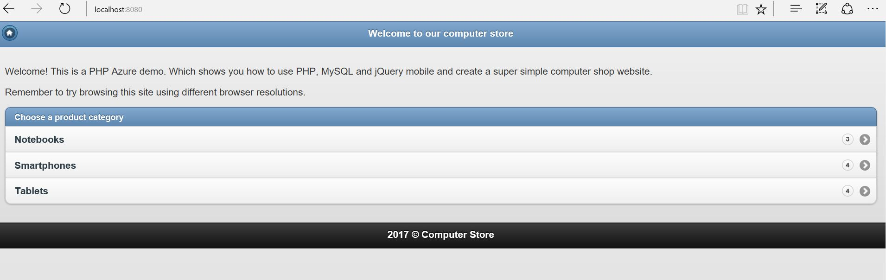
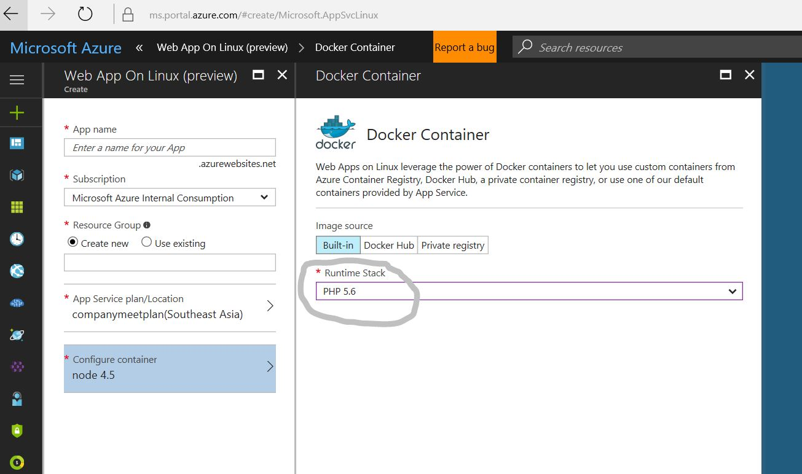
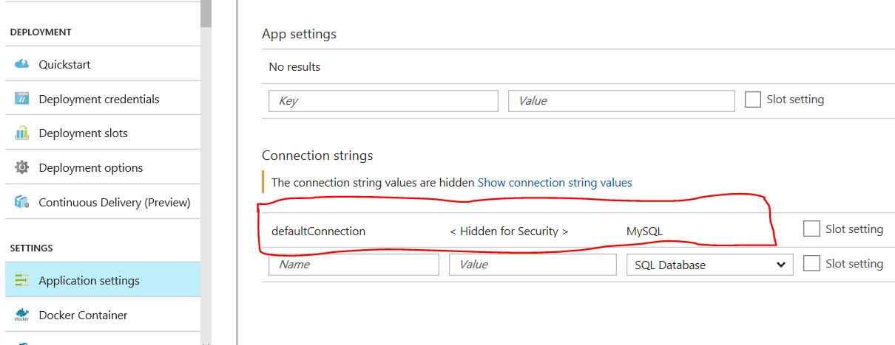

# PHP App - Running a PHP-MySQL app on Azure App services for Linux

Git clone this repo on your dev machine

    git clone https://github.com/brijrajsingh/phpappservicelinux.git

Go to tables.sql file, this file contains some dummy data that we'll need for our app, import this data (run the script) into a local mysql or an Azure based VM or on an Azure Mysql as service instance.

Make sure you have the LAMP stack installed.

Linux Users - Install the 'tasksel' utility and run it, it should install the apache as well as the mysql for you.

Go to includes/config.php and uncomment these lines and put the relevant connection values

    /*$db_host = '127.0.0.1';
    $db_user = 'root';
    $db_pass = '';
    $db_name = 'productsdb';*/

Run your php app, it should look like this

### Deploying the php-mysql web app on App services for Linux ###

Go to Azure Portal, click on new and select the SKU - Web app on Linux + Mysql (Preview), alternatively you can also select Web app on Linux (Preview) if you are planning to provision the mysql database separately.

While creating the Web app instance, select "Configure Container" option and select the  Image Source as "Built-in" and select the runtime stack as PHP 5.6

You may choose to comment out the database settings we provided before or they will anyways be over ridden when we deploy this code over app service.

Follow the steps given at this link to use Git to upload your code over this new Azure App Service - https://docs.microsoft.com/en-us/azure/app-service-web/app-service-deploy-local-git 

Go to Azure App Service -> Settings -> Application Settings -> Connection strings and create a connection string by name **'defaultConnection'** and put your connection string here, the connection string should be in proper format as shown here 

Database=dbname;Data Source=host;User Id=userid;Password=password

Your PHP App service is ready!
   

