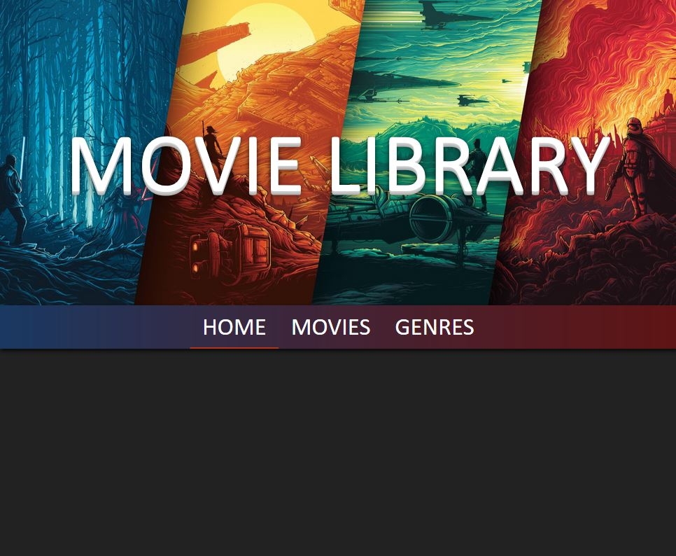
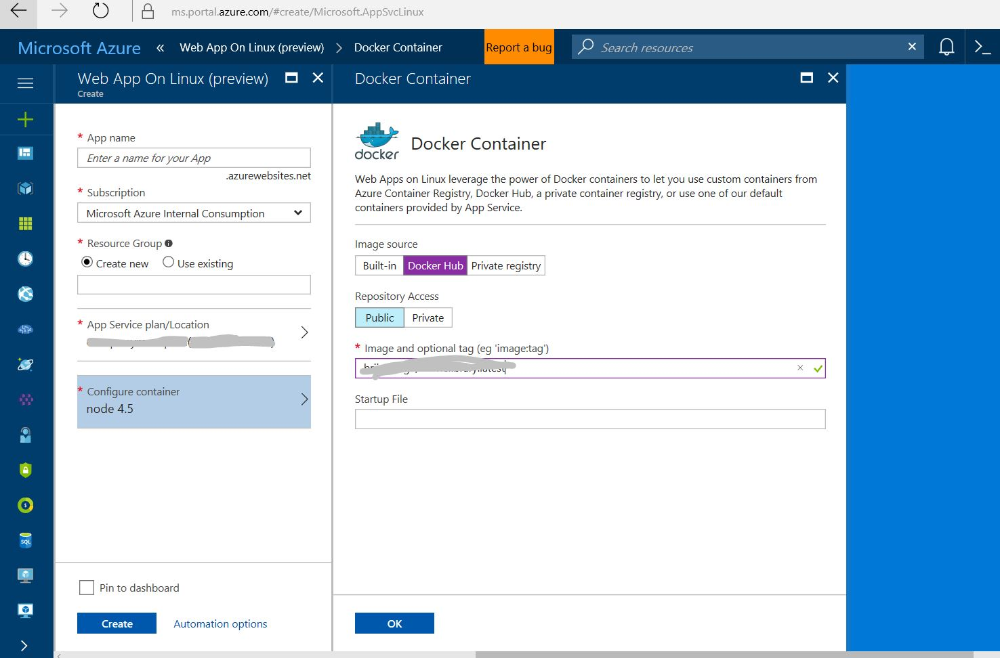
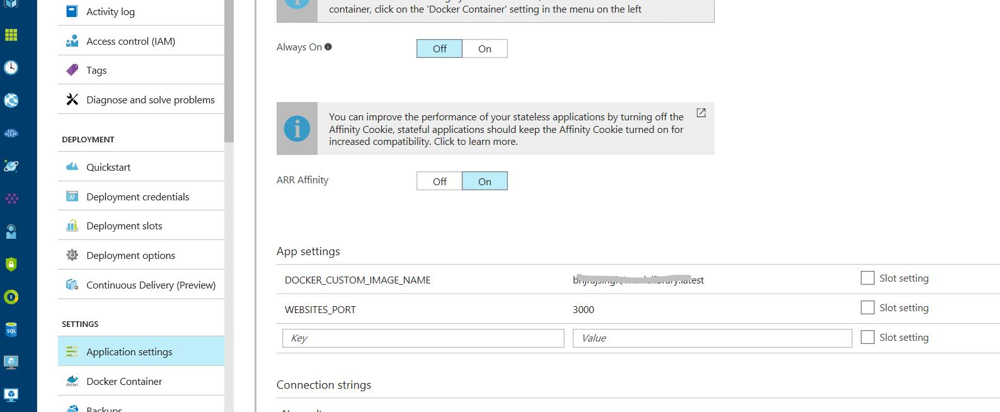

# Movie Library ROR CRUD App - Dockerized to run on Azure App services for Linux

Ruby on Rails CRUD web app docker-ized to run on Azure App services for Linux

Clone the folder from repo - 

    git clone https://github.com/brijrajsingh/rubyappservicelinux.git

CD to the code folder from command prompt
Run

    bundle update sqlite3
    bundle update
   
Generate the secret, run the below command from command prompt

    rake secret

This command will generate a secretkey. Copy the secret key to  config/secrets.yml

    development:
    secret_key_base: <rake secret key here>
    test:
    secret_key_base: <rake secret key here>
    production:
    secret_key_base: <your own secret key type whatever>

Copy your own secret key to config/initializers/secret_token.rb

Run the rails app now

    rails server

Your app must be running now at http://localhost:3000

**Docker-izing your application**

See the Dockerfile

    FROM rails:latest
    RUN mkdir -p /usr/src/app
    WORKDIR /usr/src/app
    
    COPY Gemfile /usr/src/app/
    COPY Gemfile.lock /usr/src/app/
    RUN bundle install
    
    COPY . /usr/src/app
    
    EXPOSE 3000
    CMD ["rails", "server", "-b", "0.0.0.0"]

Checkout the app running on http://localhost:3000

**Dockerizing the app** 

Make sure you have an account on dockerhub https://hub.docker.com 

**** Build docker image****
`docker build -t dockerusername/imagename:latest .`

**** Run the image in local ****

    docker run -it -p 3000:3000 dockerusername/imagename:latest

*** Push the image to docker hub ****

    docker push dockerusername/imagename:latest

Deploy to Azure App services for Linux
--------------------------------------

Go to Azure Portal, and create an instance of Azure App Services for Linux, while creating click on "configure container" and select "Docker Hub" as Image Source.

Go to App settings and set the key WEBSITES_PORT to 3000

Now restart the App service and browse to app service end point, voila!

This repository is based on https://github.com/philenius/movielibrary 

